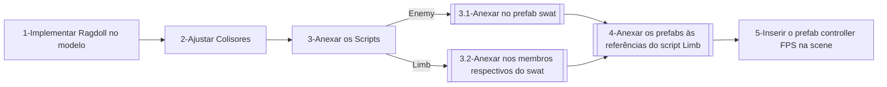

 
:construction: <b> PROJETO EM CONSTRUÇÃO </b> :construction: 

> Sistema de desmembramento por Raycast. Funciona com uma interação simples entre classes ligadas aos prefabs que serão delatados e substituídos e o sistema de FPS tradicional com uso do Raycast

> Favor não usar os prefabs originais do modelo para uso comercial, pois são apenas de referência. Use-o como referência e elabore facilmente no Blender, por exemplo.

 
:smile: <b> step by step :smile: </b>

 
 ______________________________________________________________________________________________________

 

 (Imagem - 01: Frame do sistema)

______________________________________________________________________________________________________

https://user-images.githubusercontent.com/92175791/206196030-28984c78-9a6a-4ad5-b546-de00073d571c.mp4

 (Video - 01: Sistema em ação)

______________________________________________________________________________________________________
